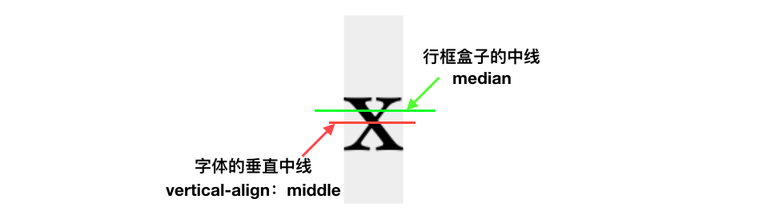

# CssNode
#### [一、CSS世界基石--元素](CSS基石/README.md)

#### [二、CSS盒尺寸](CSS盒尺寸/README.md)

### 三、CSS内联世界

在CSS世界中，内联元素地位可谓举足轻重，涉及的CSS属性非常多，这些属性往往具有继承性。在第一章CSS世界基石中已简单介绍过内联元素，遗忘的可去温习下。下面开始更深入的了解内联世界，先从内联世界的基础：内联盒模型开始介绍。

* **内联盒模型** 

> 我们知道CSS盒模型中包含四个盒子，这里的内联盒模型同样包含“四个盒子”
>
> 1、  内容区域：指一种围绕文字看不见的盒子，其大小受字符本身特性控制，本质是一个字符盒子，替换元素内容区域可以看成元素自身；
>
> 是不是不太好理解，这里可以将文本选中的背景区域作为内容区域，请看下图蓝色区域：
>
> ```css
> /*HTML*/
> <p>我背后背景高亮显示的区域就可以看为是<em>内容区域</em></p>
> ```
>
> 
>
> 2、内联盒子：指元素的“外在盒子”，用来决定元素是内联还是块级，该盒子又可细分为“内联盒子”和“匿名内联盒子”，内联盒子不会让元素成块显示，而是排成一行显示；
>
> ```css
> /*HTML*/
> <p>
>  我是匿名内联盒子
>  <span>内联盒子1</span>
>  <em>内联盒子2</em>
> </p>
> ```
>
> 如图所示：
>
> 
>
> 注意：并不是所有光秃秃的文字都是匿名内联盒子，也有可能是匿名块级盒子，关键是看前后的标签是内联还是块级；
>
> 3、行框盒子：每一行就是“行框盒子”，行框盒子由一个一个“内联盒子”组成；
>
> ```CSS
> /*HTML*/
> <p>
>  我是匿名内联盒子
>  <span>内联盒子1</span>
>  <span>内联盒子2</span>
>  <em>内联盒子3</em>
>  <em>内联盒子4</em>
>  我是匿名内联盒子
>  <span>内联盒子5</span>
>  <span>内联盒子6</span>
>  <em>内联盒子7</em>
>  <em>内联盒子8</em>
> </p>
> ```
>
> 如图所示画红色虚框的行：
>
> 
>
> 4、包含盒子：由一行一行的“行框盒子”组成的盒子，也可以认为是“包含块”，此为假想盒子，一个p标签就是一个包含盒子，如下图红色虚框所示：
>
> 
>
> 以上就是内联盒模型的简易版介绍，大家认真理解下，这是接下来深入了解内联世界的基础！


* **幽灵空白节点** 

这个概念作者在讲解内联世界时多次提到，是很多怪异现象产生的罪魁祸首，来一睹尊容吧。

> 描述：在HTML5文档声明中(这时前提条件)，内联元素的所有解析盒渲染就如同每个行框盒子的前面有一个“空白节点”一样。这个“空白节点”永远透明，不占据任何宽度，看不见也无法通过脚本获取，就好像幽灵一样，但又确确实实存在，表现如同文本节点一样。
>
> 举个例子证明下：
>
> ```css
> /*HTML*/
> <div><span></span></div>
> /*CSS*/
> div {
>  background: #ccc;
> }
> span {
>  display: inline-block;
> }
> /*此处div和span未设置任何高度，按正常理解div应该不具有高度，但是奇怪的现象出现了，直接看下图*/
> ```
>
> 
>
> 此时div的高度并不为0，在chrome下高度为22像素，在Firefox下高度为16.5像素，至于为什么是这个大小后面作出解释，大家只要知道幽灵空白节点是实实在在存在的！


* **字母x与CSS世界的基线** 

> **基线：** 小写字母x的下边缘就是我们常说的基线，意不意外！
>
> **注意点：**
>
> 1、CSS中有一个属性x-height就是指的小写字母x的高度，一个相对单位ex也是指的当前小写字母x的高度；
>
> 2、vertical-align中的默认值median也与x-height有关：在CSS世界中，median指基线往上1/2 的x-height高度，可以近似理解为x的交叉点处，从这里看出vertical-align：median并不是绝对的垂直居中；
>
> 3、在CSS世界中对于内联元素垂直居中的是对字体，而非外部的块级容器；
>
> 字母x与CSS世界基线间的关系如下图所示：
>
> 
>
> 注意：上图使用字体为宋体，其x字母中间交叉点刚好是其自身高度的1/2，但有些字体设计时存在字体下沉的现象，如微软雅黑的字体下沉比较明显，字母x的交叉点会比vertical-align：median定义的位置往上一点点，大概也就1像素的样子，我们往往也察觉不到，如下图所示：
>
> 这就导致：文字字形的垂直中线位置普遍要比真正的行框盒子的垂直中线位置低；
>
> 


* **内联元素基石 line-height** 

line-heigh可谓是内联元素的高度之本，本节开始前请大家掌握好前面内联盒模型和幽灵空白节点的内容，以便接下来顺畅的理解行高这个属性。

> **描述：** line-height用于设置行间的距离（行高），或者说是设置多行元素的空间量，如多行文本的间距；
>
> **特点：** 
>
> 1、line-height的默认值为normal，微软雅黑的normal解析值约为1.32、宋体的解析值约为1.14；
>
> 2、支持数值：如line-height：1.5，数值是相对于当前字体大小计算，如font-size为16像素，则line-height值计算为1.5 * 16px = 24px，注意该属性不支持负值;
>
> 3、支持百分比：如line-height：150%，百分比也是相对于当前字体大小计算，150% * 16px = 24px；
>
> 4、支持长度值：就是带单位的值，如line-height：24px或line-height：1.5em；
>
> 5、以上三种属性值虽然最终计算结果都一样，但在继承细节方面存在差别：
>
> 若line-height选用数值1.5，则其所有子元素继承的都是1.5这个比例值，如果子元素自身设置字体大小，其行高就是按照1.5这个比例值自行计算；
>
> 若选用150%或24px，则所有子元素继承的是最终计算值，就比如说如果父元素line-height：150%，当前字体大小为16px，则父元素行高是24px，如果此时存在子元素字体大小为32px，但其继承的行高是24px,这会导致上下排便字体重叠到一起，推荐使用数值属性值；
>
> 6、行距 = line-height - font-size，line-height 与 font-size 的计算值之差(即行距)分为2半(可以理解为半行距)分别加到一个文本行内容的顶部和底部，来决定行框盒子的高度。line-height的高度作用细节正是通过行距和半行距来实现的；
>
> 7、对于内联非替换元素和内联替换元素混排时，它决定行框盒子的最小高度，因为替换元素的高度不受line-height的影响，另外替换元素高度还受vertical-align的影响；
>
> 8、对于非替换元素的纯内联元素，它决定行框盒子的最终高度，这时padding、border属性对可视高度不产生任何影响；
>
> 9、对于块级元素，line-height对其本身是没有任何作用的，平时改变line-height的值块级元素的高度跟着变化实际上是通过改变块级元素里面内联级别元素占据的高度实现的；
>
> 10、内联元素line-height具有大值属性，就是说无论内联元素line-height如何设置，最终父元素的高度都是由数值大的那个line-height决定的；
>
> **应用：** 
>
> 1、使单行内联文本垂直居中：
>
> ```css
> <div><span>内联文本垂直居中</span></div>
> div {
>     padding: 0 20px;
>     line-height: 32px;
>     background-color: #ccc;
> }
> /*此处行高可以实现垂直居中就在于行距的上下等分机制*/
> ```
>
> 
>
> 2、多行文本或替换元素垂直居中：
>
> ```css
> /*HTML*/
> <div class="box">
>     <div class="content">
>     多行文本或替换元素的垂直居中效果，需要vertical-align帮助
>     </div>
> </div>
> /*CSS*/
> .box {
>     line-height: 100px;
>     background-color: #ccc;
> }
> .content {
>     display: inline-block;
>     line-height: 20px;
>     margin: 0 20px;
>     vertical-align: middle;
> }
> ```
>
> 
>
> 该效果实现原理如下：
>
> 1、多行文本外面使用一个标签.content包裹，设置为inline-block，是为了重置外部.box的line-height值，并设置内部.content的line-height为正常大小，其次是使.content仍然保持内联元素特性，从而可以设置vertical-align属性；
>
> 2、我们都知道每个内联元素组成的行框盒子前都会有一个“幽灵空白节点”，这里.box设置的line-height就是作用在这个空白节点上面，使得在.content元素前面撑起一个高位100像素、宽度为0的内联元素;
>
> 3、内联元素默认都是以基线对齐的，这里对.content设置vertical-align: middle来调整多行文本的垂直居中位置，以便实现垂直居中效果；


* **vertical-align** 

一般存在line-height起作用的地方，vertical-align也一定起作用，而且还是很多怪异现象的背后黑手，这里先为它们形影不离的友情干一杯，接下来慢慢介绍这个背后的黑手！

> **描述：** 用来指定行内元素或者表格元素的垂直对齐方式；
>
> **特点：** 
>
> 1、vertical-align起作用的前提条件是：只能应用于内联元素或display值为table-cell的元素；
>
> 2、vertical-align的属性值可以分为4类：
>
> a、线类：如baseline、top、middle、bottom，vertical-align的默认值是baseline；
>
> ```css
> /*HTML*/
> <div>x<i class="icon-next" style="vertical-align: top"></i></div>
> <div>x<i class="icon-next" style="vertical-align: middle"></i></div>
> <div>x<i class="icon-next" style="vertical-align: baseline"></i></div>
> <div>x<i class="icon-next" style="vertical-align: bottom"></i></div>
> /*CSS*/
> div {
>     display: inline-block;
>     margin: 20px 10px;
>     background-color: #eee;
>     font-family: 'Songti SC',sans-serif;
>     font-size: 50px;
> }
> i {
>     font-size: 20px;
> }
> ```
>
> 各线类取值对齐的位置如下图所示：
>
> 