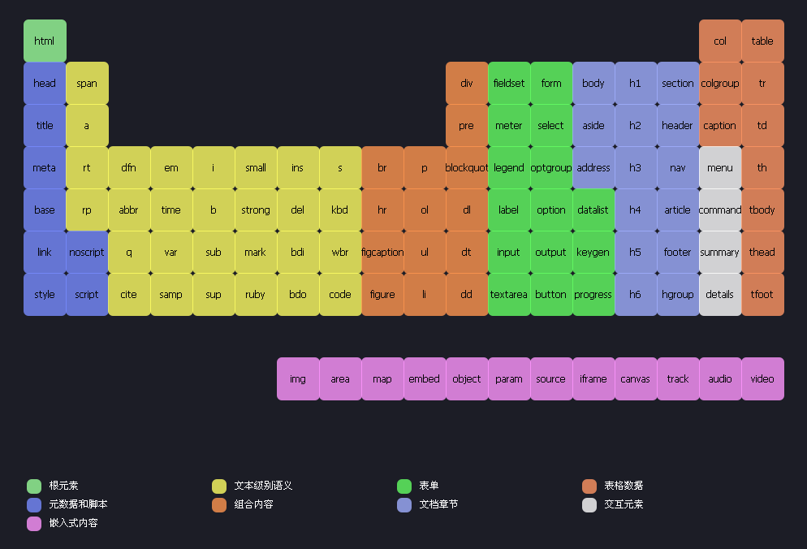

# CssNode
### 一、CSS世界基石--元素

因HTML元素作为基石般的存在，之后学习CSS不可或缺，这里就先介绍下HTML中几个比较重要的分类概念，更多详尽内容可翻阅官方文档

>HTML标签根据布局特性分为块级元素和内联元素，或者根据是否具有可替换内容分为替换元素和非替换元素，其中替换元素都属于内联水平元素；
>
>常见块级元素：div 、p、li、table等；
>
>常见内联元素：span 、a 、img 、strong 、em等；
>
>常见替换元素：img 、input 、select 、textarea 、video 、iframe 、canvas等；

* 常用HTML标签见下图（图片来自大漠老师-w3cplus.com）




* **块级元素（block）**

>**定义：**
>
>A block-level element always starts on a new line and takes up the full width available.
>
>意思就是块级元素都会从新的一行开始，若无限制宽度，则100%填充所在容器的宽度，就如同水流般会自动填充
>
>**特点：**
>
>1、块级元素单独占据一行；
>
>2、宽度默认是其所在容器的100%；
>
>3、宽高、内外边距和边框可显式控制；
>
>4、可以容纳其他块级元素和内联元素，典型代表div元素；
>
>**注意点：**
>
>1、只有块级元素存在垂直方向的margin合并现象；
>
>2、浮动和绝对定位的元素，display属性值会自动变为block，呈现块级元素特性；
>
>3、因浮动元素会块状化，所以浮动元素设置text-align、vertical-align无效；
>
>4、块级元素与“display：block”不是一个概念，例如table元素display为table，li元素display为list-table，也都是块级元素；
>
>5、clear属性只有块级元素才生效;


常见块级元素（标注h5的表示HTML5定义的新元素）：

| 元素    | 作用              | 元素         | 作用                   | 元素           | 作用               |
| :------ | :---------------- | ------------ | ---------------------- | -------------- | ------------------ |
| div     | 常用块级元素      | aside (h5)   | 伴随内容               | hgroup(h5)     | 标题组             |
| h1-h6   | 标题级别          | section (h5) | 一个页面区段           | tfoot          | 表脚注             |
| p       | 段落              | footer (h5)  | 区段尾或页尾           | figcaption(h5) | 图文信息组标题     |
| ul/ol   | 无序/有序列表     | dd           | 定义列表中定义条目描述 | noscript       | 可选脚本内容       |
| table   | 表格              | dl           | 定义列表               | nav(h5)        | 定义导航链接       |
| form    | 交互表单          | fieldset     | 表单元素分组           | main(h5)       | 规定文档的主要内容 |
| hr      | 水平分割线        | address      | 联系方式信息           |                |                    |
| header  | 区段头或页头 (h5) | blockquote   | 块引用                 |                |                    |
| article | 文章内容 (h5)     | pre          | 预格式化文本           |                |                    |


本文中元素类型可用下面代码进行验证

```javascript
//创建元素
var div = document.createElement('div');
//生成元素
document.body.appendChild(div);
//获取元素display的取值，并在控制台返回结果
console.log(window.getComputedStyle(div).display);
//block
```


* **内联元素（inline）**

> **定义：** 
>
> An inline element does not start on a new line and only takes up as much width as necessary.
>
> 意思就是内联元素会在一行连续显示，所占宽度会根据元素内容长度分配，即按需分配，呈现包裹性
>
> **特点：** 
>
> 1、内联元素会一行连续显示；
>
> 2、宽度是其内容所占的宽度；
>
> 3、高度、内外边距不能显式控制；
>
> 4、内联元素只能容纳文本或其他内联元素；
>
> **注意点：** 
>
> 1、对于非替换元素的纯内联元素，其可视高度由line-height决定，height设置无效；
>
> 2、内联元素垂直方向margin、padding仍会渲染，但不会影响布局，仅是在垂直方向与其他元素发生重叠；

常见内联元素：

| 元素  | 作用       | 元素     | 作用           | 元素       | 作用             |
| :---- | :--------- | :------- | -------------- | ---------- | ---------------- |
| a     | 链接锚点   | strong   | 粗体强调       | textarea   | 多行文本输入框   |
| img   | 图片       | sup      | 上标           | button     | 按钮             |
| span  | 文本内区块 | sub      | 下标           | input      | 输入框           |
| em    | 强调       | strike   | 中划线         | label      | 表格标签         |
| b     | 粗体       | map(h5)  | 定义图像映射   | select     | 选项标签         |
| i     | 斜体       | time(h5) | 定义日期/时间  | output(h5) | 表单输出         |
| big   | 大字体     | tt       | 定义打字机文本 | abbr       | 缩写             |
| small | 小字体     | q        | 短引用         | acronym    | 只取首字母的缩写 |
| br    | 换行       | u        | 下划线         | cite       | 引用             |

其余还有：script –  定义客户端脚本、bdo – 定义文字方向  、code – 计算机代码(在引用源码的时候需要)、dfn – 定义字段、 kbd – 定义键盘文本、samp – 范例计算机代码


* **替换元素(replaced element)** 

> 定义：An element whose content is outside the scope of the CSS formatting model.
>
> 意思就是替换元素的内容是外部对象，不在CSS模型范围控制之内，其替换性体现在可以通过修改自己某个属性值来呈现不同内容；
>
> 例如img元素可以通过src属性来更换图片、input元素可以通过type属性来决定最终是输入框还是按钮；
>
> 特点：
>
> 1、内容可以通过修改某个属性值进行替换；
>
> 2、内容的外观不受页面上CSS的影响；
>
> 3、有自己的尺寸，在替换元素没有明确尺寸设定情况下，如video、canvas的默认尺寸是300像素*150像素、img的默认尺寸为0；
>
> 4、替换元素都是内联水平元素，其替换元素的vertical-align默认值baseline指元素的下边缘；
>
> 注意点：
>
> 1、对于替换元素，如果同时存在CSS设定的尺寸、HTML原生属性设置的尺寸、替换元素自身固有的尺寸时，按下面优先级决定最终尺寸：CSS尺寸 > HTML尺寸 > 固有尺寸；
>
> 2、内联替换元素可以通过display属性变为块级替换元素，尺寸规则同样遵循第一条注意事项；
>
> 3、通过content属性插入的对象可称为匿名的可替换元素，该属性改变的仅为视觉呈现层面内容，不可被搜索引擎抓取，然后原被替换内容仍然存在，并仍可被搜索引擎抓取，另外content属性现在仅Chrome浏览器支持，其他浏览器需结合::after、::before伪元素使用content属性；
>
> 4、这里如果有不理解的地方推荐去看下《CSS世界》第四章中的第一节内容；

常见替换元素：

| 元素     | 作用                   | 元素        | 作用                   |
| :------- | :--------------------- | :---------- | ---------------------- |
| img      | 定义图像               | video（h5） | 定义视频               |
| input    | 定义输入控件           | iframe      | 定义内联框架           |
| button   | 定义按钮               | canvas(h5)  | 定义图形               |
| select   | 定义选择列表           | object      | 定义内嵌对象           |
| textarea | 定义多行的文本输入控件 | embed(h5)   | 定义外部交互内容或插件 |


到此HTML中比较重要的几个元素分类概念已介绍完毕，这几个元素分类的特点务必区分清楚，以便接下来学习CSS能事半功倍。另每个分类下的”注意点“若暂时不能理解，可先看文章后续内容，了解更多后再回头理解！

