# CssNode
**前言：**

大家学习前端一般都是以HTML、CSS、javascript...这个顺序来，我也不例外。如果把网页比作是一栋房子，那么HTML就是房子的骨架，各类元素就如墙壁、门、窗一般作用不一、各司其职。

但只有这些原始设施难免太过单调，然后CSS见机跑来自告奋勇的说：嫌单调啊，说吧想要什么风格，北欧风、自然风、少女风、宅男宅女风，随便选，保证效果满意。

人呢一般都喜欢新鲜的东西，房子风格住久了难免会厌烦想换换，这怎么办呢？别急不是还有JS这个无所不能、无所不会的存在嘛。来js，房子交给你了，想怎么拆怎么建随你，最好把房子改造的功能齐全，什么影院、健身等一应俱全，不出门就能享受全套服务，嘿嘿嘿！

愿望嘛总是无限的，房子暂时就先装修到这，不然实力撑不起愿望就惨了，至于之后待出场的大神们暂时先休息休息，全家桶什么的都先吃着，之后再聊。

本次文章先介绍CSS这么个魔法师，一起来见证魔法奇迹吧！同时也欢迎大家一起提出问题探讨交流！

**注明：**文章中很多内容参考张鑫旭《CSS世界》这本书，强烈推荐大家看看，看完后会有种：哇，CSS世界原来如此美妙的感觉！这本书个人觉得比较适合初级后进阶时阅读，书内容着重对属性表现原理的解释，特别是内联元素及内联盒模型部分的介绍，让人对布局时的各种怪异现象有了彻底的理解！


### 一、CSS世界基石--元素

因HTML元素作为基石般的存在，之后学习CSS不可或缺，这里就先介绍下HTML中几个比较重要的分类概念，更多详尽内容可翻阅官方文档

>HTML标签根据布局特性分为块级元素和内联元素，或者根据是否具有可替换内容分为替换元素和非替换元素，其中替换元素都属于内联水平元素；
>
>常见块级元素：div 、p、li、table等；
>
>常见内联元素：span 、a 、img 、strong 、em等；
>
>常见替换元素：img 、input 、select 、textarea 、video 、iframe 、canvas等；

* 常用HTML标签见下图（图片来自大漠老师-w3cplus.com）


* **块级元素（block）**

>**定义：**
>
>A block-level element always starts on a new line and takes up the full width available.
>
>意思就是块级元素都会从新的一行开始，若无限制宽度，则100%填充所在容器的宽度，就如同水流般会自动填充
>
>**特点：**
>
>1、块级元素单独占据一行；
>
>2、宽度默认是其所在容器的100%；
>
>3、宽高、内外边距和边框可显式控制；
>
>4、可以容纳其他块级元素和内联元素，典型代表div元素；
>
>**注意点：**
>
>1、只有块级元素存在垂直方向的margin合并现象；
>
>2、浮动和绝对定位的元素，display属性值会自动变为block，呈现块级元素特性；
>
>3、因浮动元素会块状化，所以浮动元素设置text-align、vertical-align无效；
>
>4、块级元素与“display：block”不是一个概念，例如table元素display为table，li元素display为list-table，也都是块级元素；
>
>5、clear属性只有块级元素才生效;


常见块级元素（标注h5的表示HTML5定义的新元素）：

| 元素    | 作用              | 元素         | 作用                   | 元素           | 作用               |
| :------ | :---------------- | ------------ | ---------------------- | -------------- | ------------------ |
| div     | 常用块级元素      | aside (h5)   | 伴随内容               | hgroup(h5)     | 标题组             |
| h1-h6   | 标题级别          | section (h5) | 一个页面区段           | tfoot          | 表脚注             |
| p       | 段落              | footer (h5)  | 区段尾或页尾           | figcaption(h5) | 图文信息组标题     |
| ul/ol   | 无序/有序列表     | dd           | 定义列表中定义条目描述 | noscript       | 可选脚本内容       |
| table   | 表格              | dl           | 定义列表               | nav(h5)        | 定义导航链接       |
| form    | 交互表单          | fieldset     | 表单元素分组           | main(h5)       | 规定文档的主要内容 |
| hr      | 水平分割线        | address      | 联系方式信息           |                |                    |
| header  | 区段头或页头 (h5) | blockquote   | 块引用                 |                |                    |
| article | 文章内容 (h5)     | pre          | 预格式化文本           |                |                    |


本文中元素类型可用下面代码进行验证

```javascript
//创建元素
var div = document.createElement('div');
//生成元素
document.body.appendChild(div);
//获取元素display的取值，并在控制台返回结果
console.log(window.getComputedStyle(div).display);
//block
```


* **内联元素（inline）**

> **定义：**
>
> An inline element does not start on a new line and only takes up as much width as necessary.
>
> 意思就是内联元素会在一行连续显示，所占宽度会根据元素内容长度分配，即按需分配，呈现包裹性
>
> **特点：**
>
> 1、内联元素会一行连续显示；
>
> 2、宽度是其内容所占的宽度；
>
> 3、高度、内外边距不能显式控制；
>
> 4、内联元素只能容纳文本或其他内联元素；
>
> **注意点：**
>
> 1、对于非替换元素的纯内联元素，其可视高度由line-height决定，height设置无效；
>
> 2、内联元素垂直方向margin、padding仍会渲染，但不会影响布局，仅是在垂直方向与其他元素发生重叠；

常见内联元素：

| 元素  | 作用       | 元素     | 作用           | 元素       | 作用             |
| :---- | :--------- | :------- | -------------- | ---------- | ---------------- |
| a     | 链接锚点   | strong   | 粗体强调       | textarea   | 多行文本输入框   |
| img   | 图片       | sup      | 上标           | button     | 按钮             |
| span  | 文本内区块 | sub      | 下标           | input      | 输入框           |
| em    | 强调       | strike   | 中划线         | label      | 表格标签         |
| b     | 粗体       | map(h5)  | 定义图像映射   | select     | 选项标签         |
| i     | 斜体       | time(h5) | 定义日期/时间  | output(h5) | 表单输出         |
| big   | 大字体     | tt       | 定义打字机文本 | abbr       | 缩写             |
| small | 小字体     | q        | 短引用         | acronym    | 只取首字母的缩写 |
| br    | 换行       | u        | 下划线         | cite       | 引用             |

其余还有：script –  定义客户端脚本、bdo – 定义文字方向  、code – 计算机代码(在引用源码的时候需要)、dfn – 定义字段、 kbd – 定义键盘文本、samp – 范例计算机代码


* **替换元素(replaced element)**

> 定义：An element whose content is outside the scope of the CSS formatting model.
>
> 意思就是替换元素的内容是外部对象，不在CSS模型范围控制之内，其替换性体现在可以通过修改自己某个属性值来呈现不同内容；
>
> 例如img元素可以通过src属性来更换图片、input元素可以通过type属性来决定最终是输入框还是按钮；
>
> 特点：
>
> 1、内容可以通过修改某个属性值进行替换；
>
> 2、内容的外观不受页面上CSS的影响；
>
> 3、有自己的尺寸，在替换元素没有明确尺寸设定情况下，如video、canvas的默认尺寸是300像素*150像素、img的默认尺寸为0；
>
> 4、替换元素都是内联水平元素，其替换元素的vertical-align默认值baseline指元素的下边缘；
>
> 注意点：
>
> 1、对于替换元素，如果同时存在CSS设定的尺寸、HTML原生属性设置的尺寸、替换元素自身固有的尺寸时，按下面优先级决定最终尺寸：CSS尺寸 > HTML尺寸 > 固有尺寸；
>
> 2、内联替换元素可以通过display属性变为块级替换元素，尺寸规则同样遵循第一条注意事项；
>
> 3、通过content属性插入的对象可称为匿名的可替换元素，该属性改变的仅为视觉呈现层面内容，不可被搜索引擎抓取，然后原被替换内容仍然存在，并仍可被搜索引擎抓取，另外content属性现在仅Chrome浏览器支持，其他浏览器需结合::after、::before伪元素使用content属性；
>
> 4、这里如果有不理解的地方推荐去看下《CSS世界》第四章中的第一节内容；

常见替换元素：

| 元素     | 作用                   | 元素        | 作用                   |
| :------- | :--------------------- | :---------- | ---------------------- |
| img      | 定义图像               | video（h5） | 定义视频               |
| input    | 定义输入控件           | iframe      | 定义内联框架           |
| button   | 定义按钮               | canvas(h5)  | 定义图形               |
| select   | 定义选择列表           | object      | 定义内嵌对象           |
| textarea | 定义多行的文本输入控件 | embed(h5)   | 定义外部交互内容或插件 |


到此HTML中比较重要的几个元素分类概念已介绍完毕，这几个元素分类的特点务必区分清楚，以便接下来学习CSS能事半功倍。另每个分类下的”注意点“若暂时不能理解，可先看文章后续内容，了解更多后再回头理解！


### 二、CSS盒尺寸

要说CSS中什么最多，那肯定是“盒子”最多。我猜很多人第一次写CSS代码时，估计都有下面类似代码出现，然后一个方方正正的盒子就出现了，如下面图片所示！

```css
//html
<div>欢迎来到CSS世界</div>
//CSS
div {
  width:100px;
  height:100px;
  padding:20px;
  margin:20px;
  border: 10px solid skyblue;
  background-color:pink;
}
```


注：这里关于CSS盒模型基础知识不多做介绍，需要补充的可去w3school.com.cn或developer.mozilla.org了解，本文章中以CSS标准盒模型为准进行讲解；


如上面图片所示，CSS盒尺寸中的盒子存在四大家族，分别是content-box、padding-box、 border-box、margin-box，依次对应content、padding、border、margin属性，图片中width和height属性默认指content-box的宽度和高度，下面来一个一个的介绍。


* **width**

该元素看似简单，但如果深入了解会发现也是深藏不露的属性之一。

该元素开始前先介绍下"流"及“流体布局“的概念，本概念由张鑫旭在《CSS世界》中提出，想详细了解的推荐直接看此书。

> **流：**可以想象为水流，就是CSS世界中引导元素排列和定位的一条看不见的水流。
>
> * 1、如果页面中添加一个块状元素，以div标签为代表，当没有设置宽度限制时，div元素默认宽度是100%与父级容器的，就像水倒进容器里自动填充可用空间，此时块级元素就具有水流般自适应的特性，表现为充分利用可用空间；
>
> * 2、如果再向该容器丢进几个内联元素，以span标签为代表，该元素就会像木块一样，依次水平排列浮在水流上面，此时内联元素就体现包裹性、不会换行的特性；
>
> **流体布局：**指利用元素”流“的特性实现各种布局效果，所以其往往具有自适应的特性，但不等同于“自适应布局”，就如表格布局也具有自适应性，但其不是“流体布局”。

width的默认值为auto，而正是这个auto使得流的特性得以充分体现，其有以下几种宽度表现，针对块状和内联元素表现特征各不相同

> **表现：**
>
> 1、充分利用可用空间：就如div等块状元素宽度默认是100%于父级容器的；
>
> 2、收缩和包裹：通俗说就是元素占据的空间或位置根据自身大小自动收缩到能包裹到自己即可，绝不贪得无厌占据更多空间，典型代表有浮动、绝对定位、inline-block元素和table元素；
>
> 3、收缩到最小：常出现在table-layout为auto的表格中，特别是列表中某列都是中文，而每列空间又不够用时，这时根据文字段行的规则，中文能断就断英文单词不能断开的特性，就容易出现中文文字列一柱擎天的效果；
>
> 4、超出容器限制：当内联元素设置white-space：nowrap时，或者内容很长的连续英文或数字时，元素内容会超出容器宽度的限制；
>
> **注意：**width作用到块状和内联的不同点（补充）：
>
> **块状元素：**1、width值为auto时，块状元素宽度表现为流体的特点，可以充分利用空间，这一特性可以延伸出“宽度分离原则”：CSS中width属性不与影响宽度的padding/border属性共存，width独立占用一层标签，如下方代码
>
> ```css
> /*1、如想设置一个元素整体占据宽度为100px，该宽度包括margin+border+padding+content，则可以让width独立占据父级标签，在子标签中设置除width的其他盒尺寸，利用流体自适应性，自动分配空间
> 2、该方法和box-size属性改变width作用细节的效果很像，大家自行取舍
> */
> .father {
>   width: 100px;
> }
> .son {
>   margin: 0 10px;
>   padding: 10px;
>   border: 1px solid;
> }
> ```
>
> 2、格式化宽度。格式化宽度仅出现在“绝对定位模型”中，也就是出现在position为absolute/fixed的元素中，对于非替换元素，当left/right或top/bottom对立方位值同时存在时，宽度大小相对于最近具有定位特性的祖先元素计算，并表现为流动性，会自动分配水平和垂直方向空间，可用来实现元素垂直居中（该特性在后面会有详细说明）
>
> **内联元素：**1、包裹性自适应性：就是元素尺寸由内部元素决定，但永远小于包含块的尺寸；
>
> 2、首选最小宽度：指元素最适合的最小宽度。例如竖排排列的汉字，最小宽度就是每个汉字的宽度，英文的最小宽度由最长的连续英文字符决定，图片等替换元素的最小宽度就是元素内容自身宽度
>
> 3、最大宽度：就是指元素可以有的最大宽度。如果内部没有块级元素或者块级元素没有设置具体宽度值，则最大宽度就是最大的连续内联盒子的宽度；


* **Height**

大家应该都知道文档流的渲染方向是按垂直方向，由上往下、由左往右渲染的，CSS的默认流方向是水平的，这就导致宽度是有限的，而高度是无限的，所以width分配规则比较复杂，height就比较随意了

>**特点：**
>
>1、支持百分比，但当父元素高度值为auto时，子元素在文档流中的高度百分比会被忽略；
>
>2、实现height：100%效果方法：
>
>a、显式设置高度值，可使用数值，或将html/body元素高度设置为height：100%；b、使用绝对定位，注意绝对定位的宽高百分比是相对于padding-box计算的，而非绝对定位元素的宽高百分比是相对于content-box计算的，所以使用时注意尺寸变化；
>
>```css
>/*HTML*/
><div class="box1"><div class="son1"></div></div>
><div class="box2"><div class="son2"></div></div>
>/*CSS*/
>.box1,.box2 {
>  width: 200px;
>  height: 100px;
>  padding: 30px;
>  background-color: #ccc;
>}
>/*son1子元素非绝对定位，这里宽度默认是auto自动填充所以省略*/
>.son1 {
>  height: 100%;
>  background-color: pink;
>}
>
>/*son2子元素绝对定位*/
>.box2 {
>  position: relative;
>}
>.son2 {
>  width: 100%;
>  height: 100%;
>  position: absolute;
>  background-color: pink;
>}
>```
>
>
>
>非绝对定位和绝对定位下子元素百分比高度的差别如下：
>
>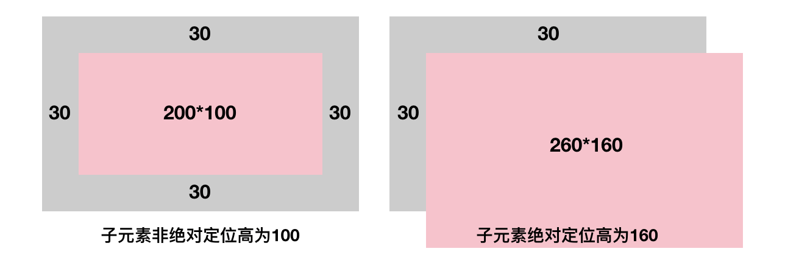


* **Content**

> **描述：**content属性与 ::before 以及 ::after 伪元素配合使用，来插入生成内容
>
> 说到content属性，大家见到的可能都是和伪元素一起来使用的，那是因为截止到现在该属性只有chrome浏览器下的所有属性才支持单独的content属性，其他浏览器仅在::before、::after伪元素中才支持；
>
> **特点：**
>
> 1、通过content属性插入的内容都是匿名替换元素，表现为内联水平元素；
>
> 2、该属性插入的内容仅为视觉呈现层面内容，搜索引擎无法抓取，所以关乎网站SEO优化方面的重要内容不要用该属性生成；
>
> 3、该属性生成的文本是无法选中、无法复制的，同样无法被搜索引擎或者屏幕阅读设备识别；
>
> 4、和伪元素一起使用时，在IE8下仅支持单冒号的伪元素，大家注意这个书写方式的兼容性问题；
>
> **用途：**
>
> 实际应用中content属性一般都应用在伪元素中，开始前先说下before和after伪元素的特点：1、不能应用到替换元素上，例如img、input元素；2、创建的元素及内容独立与html文档之外；
>
> 1、最常见的清除浮动带来的影响
>
> ```css
> .clearfix::after {
> 	content: '';
> 	display: table;
> 	clear: both;
> }
> /*注：clear属性只对块级元素有效，而伪元素利用content生成的内容都是内联水平的，所以这里需要设置display为table值，设置为block也一样*/
> ```
>
> 
>
> 2、配合@font-face规则实现图标字体效果
>
> ```css
> /*定义字体，这里的字体从icomoon.io网站下载得到，原始字体图标文件已同步到fonts文件夹下*/
> @font-face {
> font-family: 'icomoon';
> src:  url('fonts/icomoon.eot');
> src:	url('fonts/icomoon.eot') format('embedded-opentype'),
> 			url('fonts/icomoon.ttf') format('truetype'),
>  			url('fonts/icomoon.woff') format('woff'),
>  			url('fonts/icomoon.svg') format('svg');
> font-weight: normal;
> font-style: normal;
> }
> /*content对应字体图标*/
> .icon-previous::before {
> 	content: "\ea18";
> }
> .icon-next::before {
> 	content: "\ea19";
> }
> .icon-pause::before {
> 	content: "\ea1d";
> }
> 
> /*页面结构*/
> <div>
> 	<span class="icon-previous"></span>
> 	<span class="icon-pause"></span>
> 	<span class="icon-next"></span>
> </div>
> 
> ```
>
> 插入字体图标效果如下：
>
> 
>
> 
>
> 3、利用content的attr属性辅助图片内容生成，该技巧有两个重要点
>
> * 当img标签没有src属性、或者该属性值为空、再或者该属性值链接资源有误无法加载时，img即可运用before和after伪元素设置内容；
> * 上面介绍说before和after无法应用到替换元素上，像img元素，而这里正是利用这一点实现图片未加载时或加载失败时以伪元素设置好的替代布局进行占位和提示，而图片正常显示时伪元素设置内容无效，不影响正常布局，可谓一举两得；
> * 该技巧适用Chrome和Firefor浏览器，IE浏览器下存在支持问题；
>
> ```css
> /*HTML*/
> 
> /*CSS*/
> img {
> 	display: inline-block;
> 	width: 280px;
> 	height: 200px;
> /*隐藏alt中提示文字*/
> 	color: transparent;
> 	position: relative;
> 	overflow: hidden;
> 	margin: 30px;
> }
> img:not([src]) {
> /*隐藏Chrome中img标签渲染时前面显示的小图标*/
> visibility: hidden;
> }
> /*设置图片的占位背景*/
> img::before {
> 	content: '';
> 	position: absolute;
> 	left: 0;
> 	width: 100%;
> 	height: 100%;
> 	background-color: #ccc;
> 	visibility: visible;
> }
> /*设置alt信息显示条*/
> img::after {
> 	content: attr(alt);
> 	position: absolute;
> 	left: 0;
> 	bottom: 0;
> 	width: 100%;
> 	line-height: 30px;
> 	background-color: rgba(0, 0, 0, 0.5);
> 	color: white;
> 	font-size: 14px;
> 	visibility: visible;
> 	text-align: center;
> }
> ```
>
> 
>
> 最终效果如下图所示：
>
> 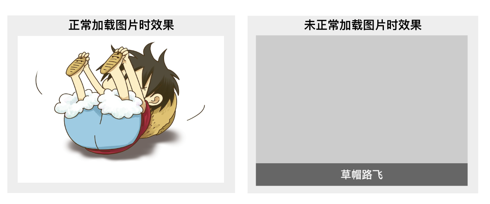


* **Padding**

>**描述：**The padding properties specify the width of the padding area of a box.
>
>意思就是元素的内容与边界之间的距离，即content-box外边界到border-box内边界的距离
>
>**特点：**
>
>1、当box-size为默认值content-box时，对于块状元素设置padding会增加元素的尺寸，内联元素设置padding在垂直方向仍会渲染发生重叠，但不会影响布局，正常情况下看不到垂直方向的渲染变化；
>
>对于内联元素这一表现特点，可以在不影响当前布局下，增加链接或者按钮的点击区域大小
>
>```CSS
>/*html*/
><div>
>	<a href="">我是链接</a>
></div>
>/*CSS*/
>div {
>  width: 100px;
>  text-align: center;
>  background-color: #bbb;
>}
>a {
>  font-size: 16px;
>  color: white;
>  background-color: pink;
>  /*增加垂直方向可点击区域*/
>  padding: 1em 0;
>}
>```
>
>链接垂直方向添加padding后点击区域大小变化如图所示（粉色区域）：
>
>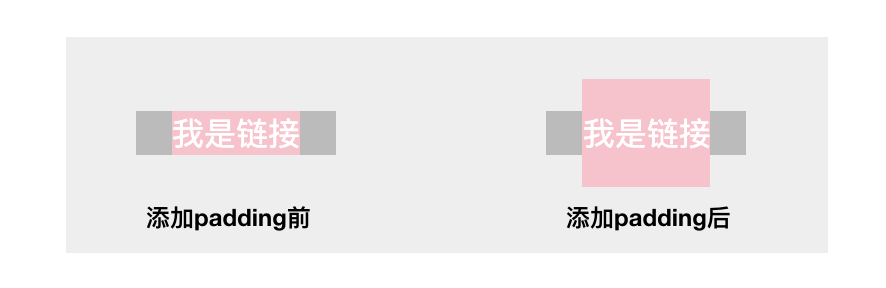
>
>2、支持百分比值，但无论水平还是垂直方向均是相对于该元素自身包含快宽度计算；
>
>3、不支持负值；
>
>4、ul/ol等部分元素初始内置padding-left值，在chrome下为40px；
>
>**应用：**
>
>与background-clip结合实现图形绘制
>
>```css
>/*双层圆点效果*/
>/*HTML*/
>/*这里选用a标签是为后面例子中借助其锚链定位特点实现轮播图效果做铺垫*/
><div>
>	<a href=""></a>
>	<a href=""></a>
>	<a href=""></a>
></div>
>
>/*CSS*/
>div {
>  text-align: center;
>  /*解决a标签与父元素div底部垂直方向存在间隙问题*/
>  line-height:0;
>}
>div > a {
>  display: inline-block;
>  width: 30px;height: 30px;
>  margin: 5px 20px;
>  border: 7px solid transparent;
>  border-radius: 50%;
>  background-color: #ccc;
>  background-clip: content-box;
>  box-sizing: border-box;
>}
>div > a:hover {
>  padding: 3px;
>  border: 3px solid #bbb;
>  background-clip: content-box;
>  background-color: #aaa;
>}
>```
>
>
>
>双层圆点效果如下，鼠标滑过时显示双层圆点效果，离开时为实心单层圆点效果：
>
>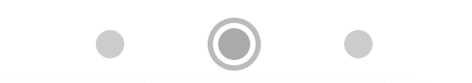


* **Margin**

> **描述：**元素的外边距，天然透明没有背景色
>
> **特点：**
>
> 1、对于表现符合“充分可利用空间”的元素，则可以通过margin改变元素内部尺寸，其中对于普通元素只能改变水平方向的尺寸，对于绝对定位具有拉伸特性的元素，则水平和垂直方向均可以，举个例子说明；
>
> ```css
> <div class="father">
> 	<div class="son"></div>
> </div>
> 
> .father {
>   width: 300px;
> }
> .son {
>   margin: 0 -20px;
> }
> ```
>
> 此时son因没有设置宽度值，表现为“充分可利用空间”的特性，所以左右设置负margin值后，相当于左右各增加20像素，son最终宽度为340像素；
>
> 可利用此特性实现两端对齐布局效果，一般情况下，实现列表水平对齐会这样设置
>
> ```css
> li {
> 	float: left;
>   width: 100px;
> 	margin-right: 10px;
> }
> ```
>
> 这时若想一排放下这三个列表，则右侧会存在一个由li元素margin-right带来的10像素间隙，这样就导致最终效果如下图所示:
>
> 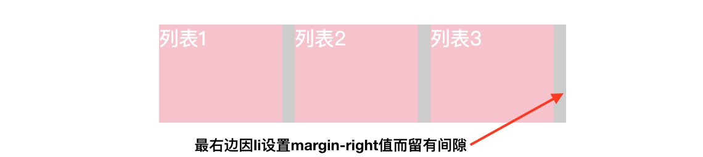
>
> 当然这个问题如果不考虑IE8，可以用下列代码解决：
>
> ```CSS
> li:nth-of-type(3n){
> 	margin-right: 0;
> }
> ```
>
> 如果需要兼容IE8则可以试试下面这种利用margin负值改变父元素尺寸的方法解决
>
> ```css
> /*HTML*/
> <div class="box">
> 	<ul>
> 		<li>列表1</li>
> 		<li>列表2</li>
> 		<li>列表3</li>
> 	</ul>
> </div>
> /*CSS*/
> .box {
>   width: 320px;
>   background-color: #ccc;
> }
> .box > ul {
>   height: 80px;
>   /*清除ul默认内置的padding-right值，chrome下为40px*/
>   paddin: 0;
>   /*增加ul父元素的宽度*/
>   margin-right: -10px;
> }
> .box > li {
>   float: left;
>   width: 100px;
>   height: 100%;
>   margin-right: 10px;
>   list-style: none;
>   background-color: pink;
> }
> ```
>
> 该方法实现原理就是：ul未设置宽度表现为流体性，其值为包含块的100%，这时设置margin-right：-10px，相当于ul的宽度为100%+10px，于是多出这10像素刚好让子元素li的最后一个margin-right：10px占据，而包含块box宽度值不变，表现为两端对齐效果
>
> 原理和最终效果如下图所示：
>
> 
>
> 
>
> 2、和padding一样，支持百分比值，同时百分比值无论是水平还是垂直方向都是相对于宽度计算的；
>
> 3、块级元素上边距和下边距有时会合并为单个外边距，即我们常说的margin合并现象，注意前面定义说能发生合并的两个约束：
>
> > a、块级元素，不包括浮动和决定定位元素；
> >
> > b、只发生在垂直方向（在writing-mode文档流方向是默认值时），或严格讲是发生在和当前文档流方向相垂直的的方向上；
> >
> > c、margin合并现象下面单独讲；
>
> 4、当margin值为auto时会发生外边距自动填充现象，有以下规则
>
> >a、如果一侧定值，一侧auto，则auto为剩余空间大小；
> >
> >b、如果两侧均为auto，则平分剩余空间；
> >
> >c、初始值是0；
>
> 该规则可有以下应用：
>
> 1、右对齐/水平居中
>
> 通过margin-left：auto实现的右对齐，有时候比float更好用
>
> ```css
> <div class="father">
>     <div class="son"></div>
> </div>
> 
> .father {
>     width: 300px;
>     height: 100px;
>     background-color: #ccc;
> }
> .son {
>     width: 200px;
>     height: 80px;
>     margin-left: auto;
>     background-color: pink;
> }
> /*当子元素设置margin：0 auto时则会水平居中，这个效果大家平时应该比较常用不再展示*/
> ```
>
> 效果如下图所示：
>
> 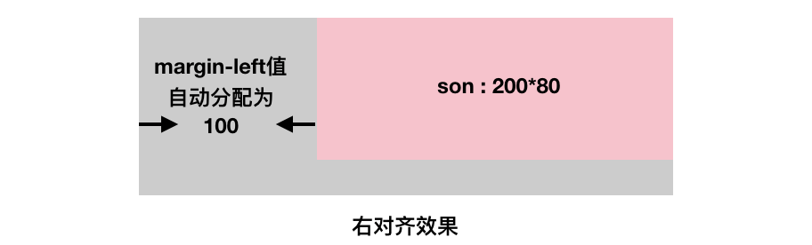
>
> 2、居中对齐
>
> 不知道大家从上面例子中发现没有，上面子元素margin在垂直方向设置auto值时却无法居中，这是因为垂直方向height没有流的特性，没法触发margin：auto自动分配填充的特点，这里可以通过设置writing-mode改变流方向后，则可以实现垂直居中，这个方法不常用不多介绍，下面介绍另外一种较常用的方法：绝对定位法
>
> ```css
> <div class="father">
>     <div class="son"></div>
> </div>
> .father {
>     width: 300px;
>     height: 100px;
>     position: relative;
>     background-color: #ccc;
> }
> .son {
>     position: absolute;
>   /*对立方向定位值均设置为0，使子元素具有格式化宽高的效果，以便垂直和水平方向均能产生流动性*/
>     left: 0;right: 0;top: 0;bottom: 0;
>     width: 200px;
>     height: 80px;
>     margin: auto;
>     background-color: pink;
> }
> ```
>
> 效果如下图所示：
>
> 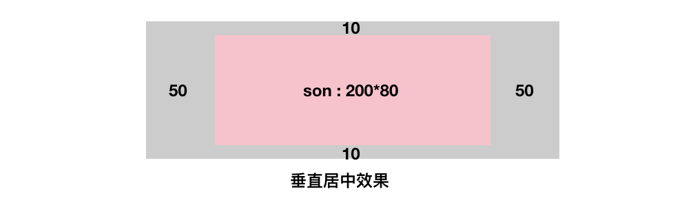
>
> 该方法先用绝对定位设置对立方位值，使子元素垂直和水平方向都具有流动性，满足margin：auto触发条件后，设置margin：auto值，利用其自动分配可用空间的特性，实现水平垂直居中的效果，该计算规则同样适用于替换元素；


**margin合并情况总结**

> **描述：**块级元素上边距和下边距有时会合并为单个外边距
>
> 从定义可以看出能发生合并有两个约束条件：
>
> 1、块级元素，不包括浮动和决定定位元素；
>
> 2、只发生在垂直方向（在writing-mode文档流方向是默认值时），或严格讲是发生在和当前文档流方向相垂直的的方向上；
>
> **合并规则：**
>
> 正正取大值、正负值相加、负负最负值
>
> **发生场景**
>
> 1、相邻兄弟元素margin合并，最常见、最根本；
>
> ```css
> /*常见的p元素，天然自带margin-top和margin-bottom值，上下margin值为当前浏览器设置的默认字体大小，即1em*/
> 
> <p>第一行</p>
> <p>第二行</p>
> <p>第三行</p>
> 
> p {
>   margin: 1em 0;
>   background-color: #ccc;
> }
> ```
>
> 合并效果如图所示：
>
> 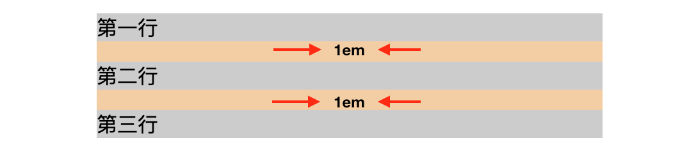
>
> 第一行p元素的margin-bottom和第二行p元素的margin-top合并，第二行p元素的margin-bottom和第三行p元素的margin-top合并；
>
> 
>
> 2、父级和第一个或者最后一个子元素marring合并，引起的奇怪现象最多；
>
> 最常见的现象就是页面设置一个块级的父元素，里面块级子元素想距离父元素上方一定距离，然后对子元素设置margin-top，这时发现不但子元素没有和父元素上方拉开距离，连父元素也跟着往下移动了！！！
>
> 如图我们希望得到下面这种效果：
>
> 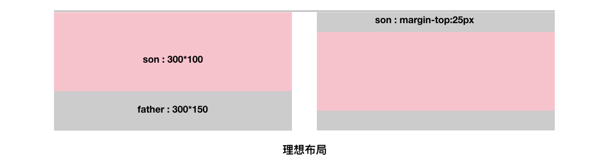
>
> 下面开始写代码：
>
> ```css
> /*HTML*/
> <div class="father">
>     <div class="son"></div>
> </div>
> /*CSS*/
> .father {
>     width: 300px;
>     height: 150px;
>     background-color: #ccc;
> }
> .son {
>     height: 100px;
>     margin-top: 25px;
>     background-color: pink;
> }
> ```
>
> 但惊奇的发现代码渲染结果如下图所示，这和咱原本目标不一样啊！
>
> 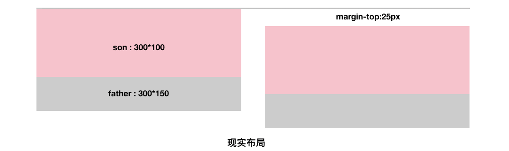
>
> 产生这种现象的原因就是因为存在父子margin合并，父元素的margin-top：0与子元素的margin-top：25px合并，根据正正取大值的合并规则，最终外边距取值25像素，导致父元素也跟着掉下来了，就像父元素设置margin-top值一样，注意这里父元素的margin-top值仍为0，和合并值无关；
>
> 解决这种合并现象的方法有很多种：
>
> 对于margin-top合并，可用以下方法（满足一种即可）：
>
> 1、父元素设置为块状格式化上下文元素，即BFC，下篇讲定位布局时会详细说明；
>
> 2、父元素设置border-top值；
>
> 3、父元素设置padding-top值；
>
> 4、父元素和第一个子元素间添加内联元素进行分隔；
>
> 对于margin-bottom合并，可用以下方法（满足一种即可）：
>
> 1、父元素设置为块级格式化上下文元素；
>
> 2、父元素设置border-bottom值；
>
> 3、父元素设置padding-bottom值；
>
> 4、父元素和最后一个子元素间添加内联元素进行分隔；
>
> 5、父元素设置height、min-height或max-height；
>
> 上面解决父元素掉下来的现象可对父元素添加overflow: hidden即可，这里是用其创建了块级格式化上下文元素；
>
> 
>
> 3、空块级元素的margin合并；
>
> ```css
> /*HTML*/
> <div class="father">
>     <div class="son"></div>
> </div>
> /*CSS*/
> .father {
>     overflow: hidden;
>     background-color: #ccc;
> }
> .son {
>   /*子元素设置上下外边距值为当前字体大小值*/
>     margin: 1em 0;
> }
> ```
>
> 对于上面代码大家不妨先想一下最终父元素的高度会是多少？这里父元素已设置BFC，不会发生父子margin合并问题，父元素的高度完全由子元素的上下margin值撑开；
>
> 最终父元素高度值为1em,如图所示
>
> 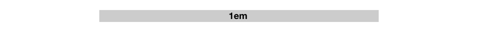
>
> 有没有人觉得是2em呢？这里请大家再看一次margin合并的描述：块级元素上边距和下边距有时会合并为单个外边距，这里说上边距和下边距不能为同一个元素了吗？哈哈哈，还真没说，所以对于空块级元素其自身margin-top值会和自身margin-bottom值进行合并，再看下面代码
>
> ```css
> /*HTML*/
> <p>第一行</p>
> <div></div>
> <p>第二行</p>
> /*大家觉得这里的div会影响上下p元素间距吗？*/
> ```
>
> 直接看效果吧，完全没影响，两个p元素间间距仍为1em；
>
> 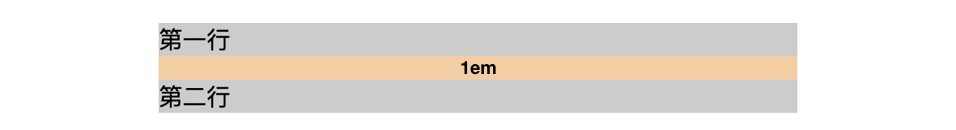
>
> 这里共发生三次margin合并：
>
> 1、第一个p元素margin-bottom和div的margin-top值合并，合并后div上边距有1em空隙；
>
> 2、第二个p元素margin-top和div的margin-bottom值合并，合并后div下边距有1em间隙；
>
> 3、中间div元素margin-top和自身的margin-bottom值再次合并，原本div上下均有的1em间隙这时再次合并为仅有的1em间隙；
>
> 
>
> 大家明白了吧，正是以上这些margin合并规则使得其有以下几点好处：
>
> 1、对于兄弟元素的margin合并：可以让图文信息的排版更自然；
>
> 2、对于父子margin合并：在页面中任何地方嵌套或直接放入任何裸div，都不会影响原来的块状布局；
>
> 3、对于元素自身margin合并：可用避免不小心遗落或者生成的空标签影响排版和布局；


**margin无效情况总结 **

>1、display值为inline的非替换元素垂直方向margin无效；
>
>2、表格中tr、td或display值为table-cell或table-row的元素margin无效；
>
>3、margin合并时，更改margin值可能无效，如相邻兄弟元素垂直方向最大的margin值为50像素，则只要修改的margin值小于50像素，则可能会无效；
>
>4、绝对定位元素的非定位方向margin值无效；
>
>5、定高容器的子元素的margin-bottom或者宽度定死的子元素的margin-right的定位失效；
>
>6、鞭长莫及导致margin失效；
>
>7、内联特性导致margin失效；